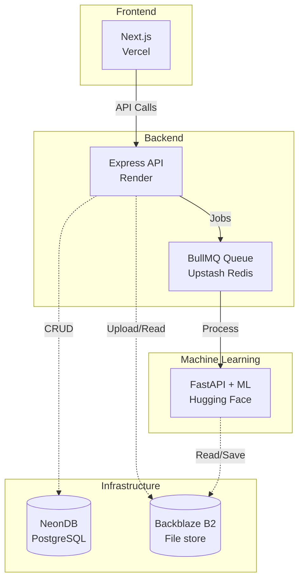

# 🌍 TerraVis

<div align="center">
  
  
  
</div>
<br />

> **Generative AI platform for satellite imagery reconstruction and enhancement.**

**TerraVis** combines two ISRO hackathon problem statements into a single end-to-end pipeline:

1. **PS2 — Cloud Removal & Reconstruction**: Removes cloud cover from Sentinel-2 optical imagery and reconstructs the obscured ground using a **Pix2Pix GAN**, with optional Sentinel-1 SAR fusion.
2. **PS10 — Infrared Colorization & Enhancement**: Converts single-channel thermal infrared Landsat 8/9 imagery into colorized, super-resolved RGB output using **ESRGAN + Pix2Pix**, improving human interpretability of thermal scenes.

Both pipelines share a common preprocessing stack (cloud masking, band alignment, normalization, patch extraction) and are evaluated using PSNR, SSIM, FID, and inference time metrics.

---

## 🎯 Why this matters

Cloud cover blocks an estimated **60-70%** of optical satellite imagery at any given time, severely delaying disaster response, agricultural monitoring, and land-use analysis. 

On the other hand, thermal infrared imagery, while cloud-penetrating, is extremely difficult for non-specialists to interpret due to its monochrome nature. 

**TerraVis** addresses both of these gaps with generative reconstruction, making more of the available imagery usable and interpretable faster.

---

## 🏗️ Architecture



### Monorepo Structure

The project is structured as a monorepo managed with **Turborepo** + **Bun**:

- 💻 `apps/web` — Next.js (App Router) frontend, deployed on Vercel.
- ⚙️ `apps/api` — Express + Bun backend with Prisma ORM, deployed on Render.
- 🧠 `apps/ml` — Python FastAPI ML inference service, deployed on Hugging Face Spaces.

---

## 🛠️ Tech Stack

| Category | Technologies |
| :--- | :--- |
| **Frontend** | Next.js, Tailwind CSS |
| **Backend** | Express.js (Bun runtime), Prisma ORM |
| **Database** | NeonDB (serverless PostgreSQL) |
| **File Storage** | Backblaze B2 (S3-compatible) |
| **Job Queue** | BullMQ + Upstash Redis |
| **ML Inference** | Python, PyTorch, FastAPI |
| **Models** | Pix2Pix (GAN), ESRGAN (super-resolution) |
| **Preprocessing** | GDAL, Rasterio, Albumentations |

---

## 🛰️ Data Sources

- **PS2**: Sentinel-2 optical imagery via [Copernicus Open Access Hub](https://dataspace.copernicus.eu/) / Sentinel Hub EO Browser.
- **PS10**: Landsat 8/9 via [USGS EarthExplorer](https://earthexplorer.usgs.gov/) (Band 10 thermal IR as input, Bands 4/3/2 RGB as target).

---

## 🚀 Setup & Local Development

> **Note**: Full setup instructions for `web`, `api`, and `ml` packages, including environment variables, will be detailed as each package is completed.

### Prerequisites
- [Bun](https://bun.sh/)
- [Python 3.10+](https://www.python.org/)

### Getting Started

1. **Clone the repository**
   ```bash
   git clone <repo-url>
   cd ISRO-Hackathon/terravis
   ```

2. **Install dependencies**
   ```bash
   bun install
   ```

3. **Run development servers**
   ```bash
   bun run dev
   ```

---

## 📄 License

TBD
