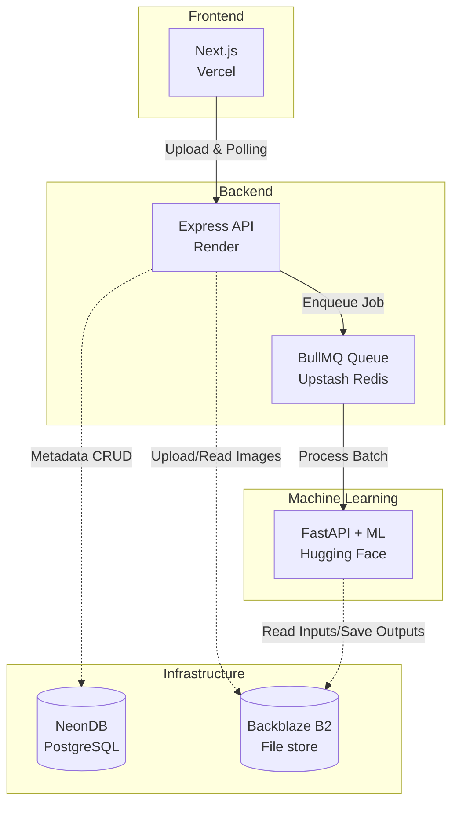

# 🌍 TerraVis

<div align="center">
  
  
  
  
</div>

<div align="center">
  <h3><strong>Generative AI platform for satellite imagery reconstruction and enhancement.</strong></h3>
</div>

<p align="center">
  TerraVis combines two ISRO hackathon problem statements into a single, seamless end-to-end pipeline. It leverages advanced Generative Adversarial Networks (GANs) and super-resolution techniques to make obscured and difficult-to-interpret satellite imagery clear, usable, and beautiful.
</p>

---

## 📑 Table of Contents

- [✨ Key Features](#-key-features)
- [🎯 The Problem](#-the-problem)
- [🏗️ Architecture](#-architecture)
- [📁 Project Structure](#-project-structure)
- [🛠️ Tech Stack](#-tech-stack)
- [🛰️ Data Sources](#-data-sources)
- [🚀 Setup & Local Development](#-setup--local-development)
- [🤝 Contributing](#-contributing)
- [📄 License](#-license)

---

## ✨ Key Features

1. **PS2 — Cloud Removal & Reconstruction** ☁️➡️🌍
   - **Input**: Cloud-obscured Sentinel-2 optical imagery.
   - **Process**: Removes cloud cover and reconstructs the ground using a **Pix2Pix GAN**. Optional Sentinel-1 SAR fusion provides structure-guided inpainting.
   - **Output**: Clean, cloud-free optical imagery ready for analysis.

2. **PS10 — Infrared Colorization & Enhancement** 🔴➡️🎨
   - **Input**: Single-channel thermal infrared Landsat 8/9 imagery (Band 10).
   - **Process**: Converts thermal data into colorized, super-resolved RGB using **ESRGAN + Pix2Pix**.
   - **Output**: High-resolution, human-interpretable RGB scenes mapping thermal signatures to visual contexts.

3. **Unified Pipeline** ⚙️
   - Common preprocessing stack: Cloud masking, band alignment, normalization, and patch extraction.
   - Built-in evaluation metrics: PSNR, SSIM, FID, and inference time tracking.

---

## 🎯 The Problem

Cloud cover blocks an estimated **60-70%** of optical satellite imagery at any given time, severely delaying disaster response, agricultural monitoring, and land-use analysis. 

On the other hand, thermal infrared imagery, while capable of penetrating certain atmospheric conditions and revealing critical temperature data, is extremely difficult for non-specialists to interpret due to its low-resolution, monochrome nature. 

**TerraVis** addresses both of these gaps. By employing state-of-the-art generative reconstruction, it recovers lost optical data and enhances thermal data, making more of the available satellite imagery usable and interpretable faster.

---

## 🏗️ Architecture



---

## 📁 Project Structure

The project is architected as a highly scalable monorepo managed with **Turborepo** and **Bun**.

```text
terravis/
├── apps/
│   ├── web/        # Next.js (App Router) frontend, deployed on Vercel
│   ├── api/        # Express + Bun backend with Prisma ORM, deployed on Render
│   └── ml/         # Python FastAPI ML inference service, deployed on Hugging Face Spaces
├── packages/       # Shared internal libraries (types, UI components, configs)
├── turbo.json      # Turborepo configuration
├── bun.lock        # Fast, deterministic dependency locking
└── package.json    # Workspace definition
```

---

## 🛠️ Tech Stack

| Category | Technologies |
| :--- | :--- |
| **Frontend** |   |
| **Backend** |    |
| **Database** |  (NeonDB Serverless) |
| **File Storage** |  (S3-compatible) |
| **Job Queue** | BullMQ +  (Upstash) |
| **ML Inference** |    |
| **Models** | Pix2Pix (GAN), ESRGAN (Super-resolution) |
| **Geospatial** | GDAL, Rasterio, Albumentations |

---

## 🛰️ Data Sources

- **PS2 (Cloud Removal)**: Sentinel-2 optical imagery sourced via the [Copernicus Open Access Hub](https://dataspace.copernicus.eu/) and Sentinel Hub EO Browser.
- **PS10 (Thermal Enhancement)**: Landsat 8/9 imagery sourced via [USGS EarthExplorer](https://earthexplorer.usgs.gov/). (Band 10 thermal IR serves as the input, and Bands 4/3/2 RGB serve as the target for training).

---

## 🚀 Setup & Local Development

> **Note**: Full setup instructions for the individual `web`, `api`, and `ml` packages (including required `.env` variables) will be detailed in their respective `README.md` files as they are completed.

### Prerequisites
- [Bun](https://bun.sh/) (v1.0.0+)
- [Python](https://www.python.org/) (3.10+)
- [Git](https://git-scm.com/)

### Getting Started

1. **Clone the repository**
   ```bash
   git clone https://github.com/your-username/ISRO-Hackathon.git
   cd ISRO-Hackathon/terravis
   ```

2. **Install dependencies**
   Install all dependencies across the entire monorepo extremely fast using Bun:
   ```bash
   bun install
   ```

3. **Run development servers**
   Start the frontend and backend simultaneously using Turborepo:
   ```bash
   bun run dev
   ```

---

## 📸 Screenshots (Coming Soon)

<!-- Add your UI screenshots here once available -->
*Demonstrations of cloud removal and thermal colorization will be placed here.*

---

## 🤝 Contributing

This project is actively being developed for the ISRO Hackathon. While currently managed by our team, we welcome discussions and feedback. 

If you are a judge or reviewer, please refer to the `docs/` folder (if available) for detailed reports, training metrics, and model weights.

---

## 📄 License

This project is licensed under the MIT License - see the [LICENSE](LICENSE) file for details. (Note: Subject to change based on ISRO Hackathon rules).

<br/>
<div align="center">
  <i>Built with ❤️ for the ISRO Hackathon.</i>
</div>
